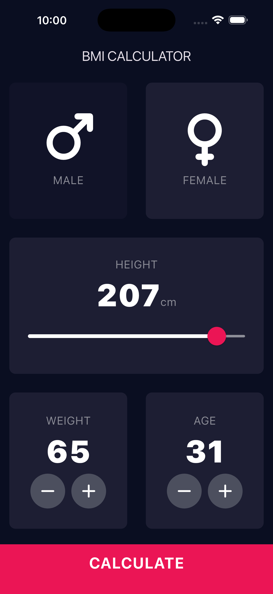
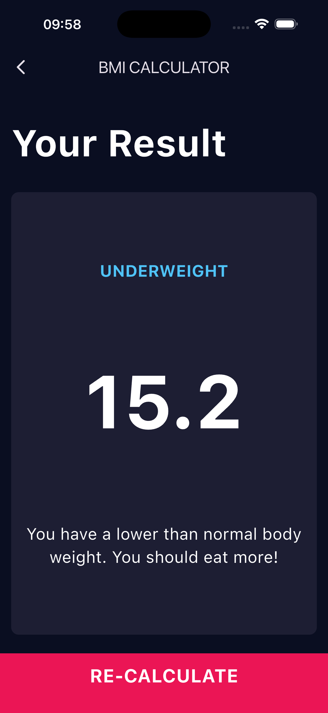

# Application Calculateur d'IMC (BMI Calculator)

Application Flutter pour calculer l'Indice de Masse Corporelle (IMC/BMI) avec une interface moderne et intuitive.

## Captures d'écran

L'application comprend deux écrans principaux :
1. **Écran de saisie** : Sélection du sexe, taille (slider), poids et âge (compteurs)
2. **Écran de résultat** : Affichage de l'IMC calculé avec interprétation colorée




## Fonctionnalités

- Sélection du sexe (Homme/Femme)
- Slider interactif pour la taille (120-220 cm)
- Compteurs +/- pour le poids (30-200 kg) et l'âge (10-100 ans)
- Calcul automatique de l'IMC selon la formule : **IMC = poids(kg) / taille²(m)**
- Interprétation du résultat :
   - **IMC ≤ 18.5** : Sous-poids (bleu)
   - **18.5 < IMC < 25** : Poids normal (vert)
   - **IMC ≥ 25** : Surpoids (orange)
- Navigation fluide entre les écrans
- Design moderne avec thème sombre

## Architecture du projet

```
lib/
├── main.dart                    # Point d'entrée de l'application
├── models/
│   └── imc_calculator.dart     # Logique métier (calculs IMC)
├── screens/
│   ├── home_screen.dart        # Écran principal (saisie)
│   └── result_screen.dart      # Écran de résultat
├── widgets/
│   ├── custom_button.dart      # Bouton personnalisé
│   ├── gender_content.dart     # Widget icône + label sexe
│   ├── reusable_card.dart      # Carte réutilisable
│   └── round_icon_button.dart  # Boutons circulaires +/-
└── utils/
    └── constants.dart          # Constantes (couleurs, styles)
```


## Installation et lancement

### Prérequis
- Flutter SDK ≥ 3.10.1
- Dart SDK (inclus avec Flutter)
- Un IDE (VS Code, Android Studio) ou éditeur de texte

### Étapes

1. **Cloner le projet**
   ```bash
   git clone <url-du-repo>
   cd imc_app
   ```

2. **Installer les dépendances**
   ```bash
   flutter pub get
   ```

3. **Vérifier qu'aucune erreur n'est présente**
   ```bash
   flutter analyze
   ```

4. **Lancer l'application**
   
   Sur un émulateur/simulateur déjà lancé :
   ```bash
   flutter run
   ```
   
   Sur un appareil physique connecté :
   ```bash
   flutter devices  # Liste les appareils disponibles
   flutter run -d <device-id>
   ```

5. **Hot Reload** (pendant l'exécution)
   - Appuyez sur `r` dans le terminal pour recharger l'app
   - Appuyez sur `R` pour un restart complet
   - Appuyez sur `q` pour quitter

## Tests

Lancer les tests unitaires et widget :
```bash
flutter test
```

## Dépendances

- `flutter` : Framework Flutter
- `cupertino_icons` : Icônes iOS
- `font_awesome_flutter` : Icônes Font Awesome (symboles ♂️ ♀️ et +/-)

## Personnalisation

### Modifier les couleurs
Éditez `lib/utils/constants.dart` :
```dart
const kBackgroundColor = Color(0xFF0A0E21);  // Fond principal
const kPrimaryButtonColor = Color(0xFFEB1555); // Bouton Calculate
```

### Ajuster les limites
```dart
const double kMinHeight = 120.0;  // Taille minimale
const double kMaxHeight = 220.0;  // Taille maximale
const int kMinWeight = 30;        // Poids minimal
```

## Débogage courant

### Problème : "Multiple Dart VM instances..."
**Solution** : Arrêtez tous les processus Flutter en cours (`q` dans tous les terminaux).

### Problème : Overflow errors
**Solution** : Ces avertissements apparaissent dans les tests à petite résolution. Sur un vrai appareil, l'app fonctionne correctement.

### Problème : Hot reload ne fonctionne pas
**Solution** : Utilisez Hot Restart (`R`) après avoir modifié `main.dart` ou les constructeurs.

## Ressources d'apprentissage Flutter

- [Documentation officielle Flutter](https://docs.flutter.dev/)
- [Flutter Widget Catalog](https://docs.flutter.dev/ui/widgets)
- [Dart Language Tour](https://dart.dev/guides/language/language-tour)
- [Flutter Cookbook](https://docs.flutter.dev/cookbook)

## Contribution

N'hésite pas à expérimenter avec le code :
1. Ajoute de nouvelles fonctionnalités (historique des calculs, graphiques, etc.)
2. Améliore le design (animations, transitions)
3. Ajoute la persistance des données (shared_preferences, sqflite)
4. Implémente l'internationalisation (support multilingue)

